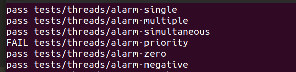

# Operating-System

> This is a project repository for BUAA 2020 OS Course :desktop_computer:

### Project 1：Thread

#### ASSIGNMENT 0: Design Document

> to be continue

#### ASSIGNMENT 1: Alarm Clock​ :alarm_clock:

**WHAT TO DO**：replace the busy waiting with other solution.

**HOW TO DO**：

1. Custom a wake up pool **OR** change the thread structure to add a wake up viables member ( This  time will use the latter one )

2. Block the thread when it falls into sleep ( only when ticks > 0)
3. Set timer_reminder trying to wake up the Blocked thread. ( when ticks_to_wakeup==0 it will successfully wake up (unblock) the blocked thread )

#### SUCCESSFULLY PASSED?：:o:

#### ASSIGNMENT 2: 

#### ASSIGNMENT 3: 